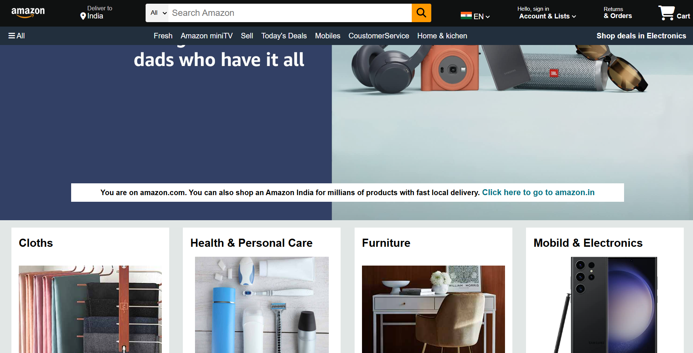
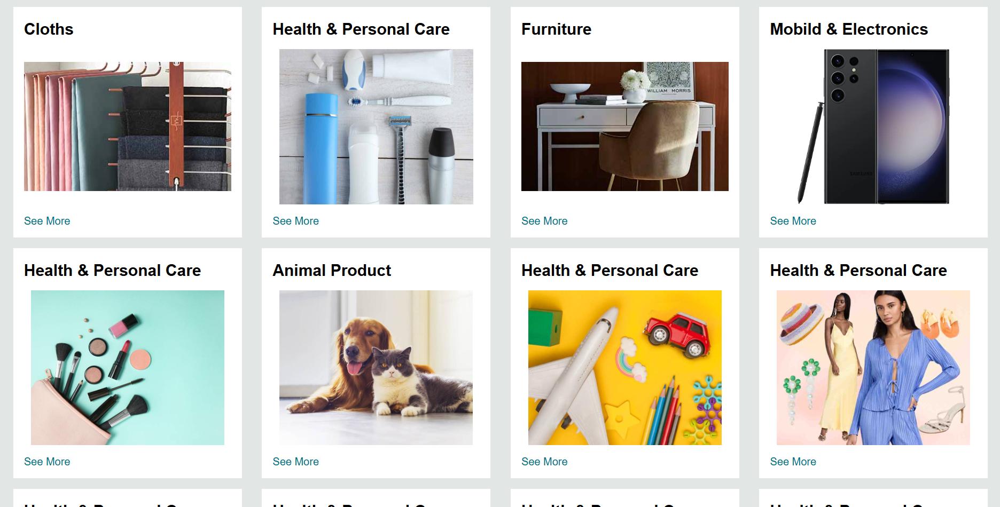
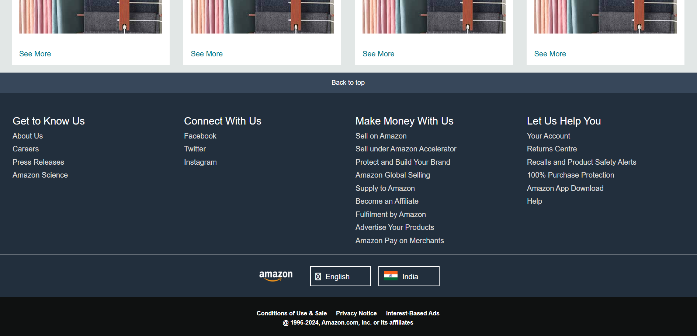

# 🛒 Amazon Clone - Frontend (HTML & CSS Practice)

A fully responsive frontend clone of the **Amazon.in** homepage built from scratch using pure **HTML5** and **CSS3**. 

This project was built to master web layout design, responsive layouts (media queries), and semantic HTML structure. The structure and styling were guided by the structured teaching of [Apna College's YouTube Channel](https://youtu.be/nGhKIC_7Mkk?si=7a44adAuSH7kFc5j).

---

## 🔗 Quick Links

*   **⚡ Live Demo:** [View Live Site](https://marsalshyam.github.io/amazon_clone_fontend_using_CSS/)
*   **💻 GitHub Repository:** [Source Code](https://github.com/MarsalShyam/amazon_clone_fontend_using_CSS.git)
*   **🎥 Reference Tutorial:** [Apna College - HTML & CSS Tutorial](https://youtu.be/nGhKIC_7Mkk?si=7a44adAuSH7kFc5j)

---

## 📸 Screenshots

Here is how the project looks across different sections:

<div align="center">
  <h3>1. Header & Hero Section</h3>
  
  
  <h3>2. Product Grid Showcase</h3>
  
  
  <h3>3. Footer & Quick Links</h3>
  
</div>

---

## ✨ Features Replicated

1.  **Header Navigation (Navbar):**
    *   Amazon Logo & location pin selector ("Deliver to India").
    *   Unified Search Bar with a dropdown category selector, search text input, and magnification icon.
    *   Language/Country selector displaying the Indian national flag and a custom dropdown.
    *   Sign-in accounts menu & Orders/Returns quick navigation.
    *   Cart button styled with the standard shopping cart icon and badge spacing.
2.  **Sub-navbar Panel:**
    *   "All" menu drawer toggle placeholder.
    *   Horizontal navigation links (Fresh, Mobiles, Sell, miniTV, etc.) that hide or wrap gracefully on smaller displays.
    *   Deals highlight text highlighting electronic items.
3.  **Hero Section:**
    *   Large high-quality slider background showing typical Amazon promotional banners.
    *   A geo-targeting notification bar notifying users about local delivery option for Amazon India.
4.  **Product Section:**
    *   Responsive grid cards highlighting different categories (Clothes, Furniture, Electronics, Pets, etc.).
    *   Hover zoom and active states for cards.
5.  **Multi-tiered Footer:**
    *   "Back to top" button.
    *   Detailed site links split into 4 columns (Get to Know Us, Connect with Us, etc.).
    *   Country/Language picker widget.
    *   Bottom copyright disclaimer panel conforming to Amazon's layout design guidelines.

---

## 🛠️ Tech Stack & Concepts Applied

This clone is purely built with standard frontend technologies to establish a solid CSS foundation:

*   **HTML5:** Semantic element tags (`<header>`, `<main>`, `<footer>`, `<nav>`, `<section>`) for clean and accessible structure.
*   **CSS3 (Flexbox & Responsive Design):**
    *   **Flexbox Grid Layout:** Extensive use of `display: flex`, `justify-content`, `align-items`, and `flex-wrap` to align items without floating issues.
    *   **CSS Custom Variables:** Centralized color variables (`--amazon-black`, `--amazon-blue`, etc.) in `:root` to preserve consistent design theming.
    *   **Box Model Mastery:** Precise tuning of margins, padding, border outlines, and dimensions (`box-sizing: border-box`).
    *   **Media Queries:** Smooth transitions and adaptive layout changes (hiding non-essential links, wrapping nav elements) to look good on tablets and mobile screens.
*   **Font Awesome Icons:** Imported via CDN for scalable vector icons representing location, search, cart, world, and menu symbols.

---

## 🧠 Learning Journey & Highlights

This project was a major milestone in my frontend learning path:
*   **Before:** Understanding divs, margins, and layouts felt a bit abstract, and arranging items on a page was challenging.
*   **During:** Under Apna College's structured guidance, I learned how to build complex, nested layouts methodically. Recreating a massive site like Amazon forced me to pay attention to small details, such as how borders behave on hover and how text wraps when the window shrinks.
*   **After:** I have a strong, intuitive understanding of Flexbox, CSS alignment, and writing responsive media queries.

---

## 🚀 How to Run Locally

Since this is a client-side frontend project, you can run it instantly:

1.  **Clone the Repository:**
    ```bash
    git clone https://github.com/MarsalShyam/amazon_clone_fontend_using_CSS.git
    ```
2.  **Navigate to the project folder:**
    ```bash
    cd amazon_clone_fontend_using_CSS
    ```
3.  **Open index.html:**
    *   Simply double-click the `index.html` file to open it in your browser.
    *   Or use the **Live Server** extension in VS Code to run a local dev server with auto-refresh.

---

## 🌟 Acknowledgement

A huge thanks to **Apna College** and the instructor for the amazing [HTML & CSS YouTube tutorial](https://youtu.be/nGhKIC_7Mkk?si=7a44adAuSH7kFc5j). It was the perfect structured roadmap to gain styling confidence!
